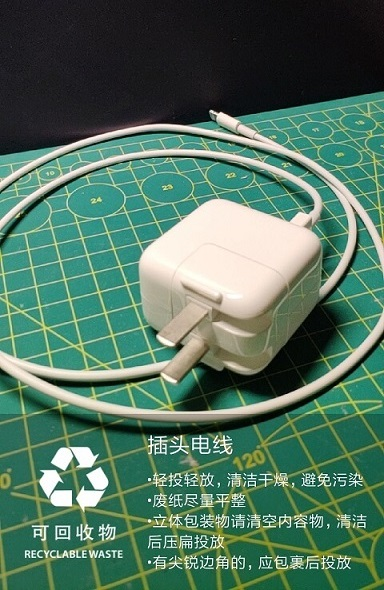

# garbage-classification-android

</p/

使用 [TensorFlow Lite](https://www.tensorflow.org/lite) 在移动端进行图像识别，识别不同的垃圾并进行分类。

基础模型在 [MobileNetV2](https://keras.io/applications/#mobilenetv2)（ImageNet）基础上进行迁移学习，识别 40 种不同的垃圾。

## 如何更换模型

将模型文件重命名为 `garbage.tflite`，复制到`/android/app/src/main/assets`，然后重新构建。

如果模型的预处理步骤、输入尺寸或输出类别等参数有变化，则需要修改 [`Classifier`](https://github.com/nex3z/garbage-classification-android/blob/master/app/src/main/java/com/nex3z/garbageclassification/classifier/Classifier.kt) 中的对应代码。

## 如何转换模型

TensorFlow Lite 的模型使用 [FlatBuffer](https://google.github.io/flatbuffers/) 格式，可以使用 [TensorFlow Lite converter](https://www.tensorflow.org/lite/convert) 对 TensorFlow 模型进行转换。

- [Python API](https://www.tensorflow.org/lite/convert/python_api)
- [Command line](https://www.tensorflow.org/lite/convert/cmdline_examples)
